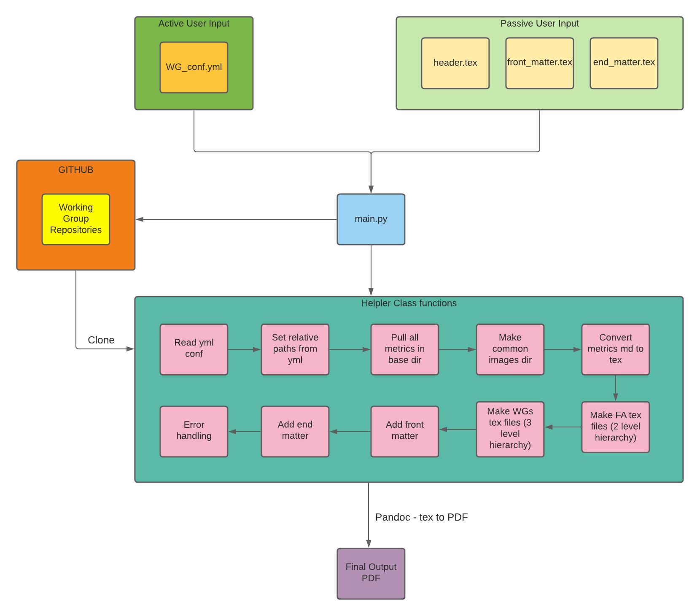

     
    <h2>
        Metrics Automated Release System
    </h2>

## Why M.A.R.S.

CHAOSS metrics have been defined to provide an in-depth view into the various features of an open-source project. The metrics are also a key input to help organizations strategically invest their resources.

M.A.R.S. (Metrics Automated Release System) aim is to automate & improve the metric release process. Keeping in mind the ever evolving CHAOSS, the system is scalable and flexible enough for easy tweaking in future.

The final outcome is generation of reports for the metrics and their translations counterparts respectively.

**_to be updated_**

## Workflow

The following image gives a high level overview of the workflow of M.A.R.S.

## Walkthrough

A rough walkthrough of the automation process:
 
* Load the yml conf file
* Load the side scripts
* Cleanup test_env directory
* Clone the WG repositories
* Generate relative paths to metric markdown files in various WGs
* Pull all the metrics in base folder
* Make a common images directory
* Decrease heading levels (only in metric markdowns) by appending `##`
* Convert metrics markdown to tex
* Generate focus areas tables in tex (2 level hierarchy)
* Generate WG markdowns tex files for headings (3 level hierarchy)
* Add front and end matter
* Call pandoc to generate the final PDF
* Move the final PDF to the output directory

## Requirements

* LaTeX :
  * Debian-based : `sudo apt-get install texlive-full`
  * MacOS : [here](https://tug.org/mactex/)
  * Windows : [here](https://miktex.org/download/#collapse264)
* pyyaml : `pip3 install pyyaml`

## Usage

_to be added after pushing the scripts_

## Mentors

* [Georg Link](https://github.com/georgLink)
* [Jaskirat Singh](https://github.com/jaskiratsingh2000)
* [Kevin Lumbard](https://github.com/klumb)
* [Matt Germonprez](https://github.com/germonprez)

## Students

* [Ritik Malik](https://github.com/ritik-malik)
* [Yash Prakash](https://github.com/yash2002109)

     

## License

Licensed under MIT License