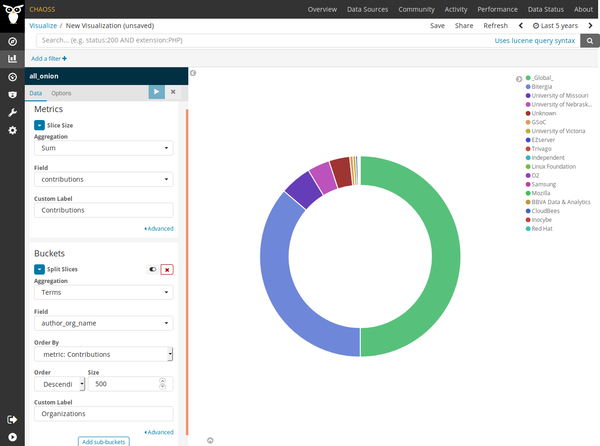
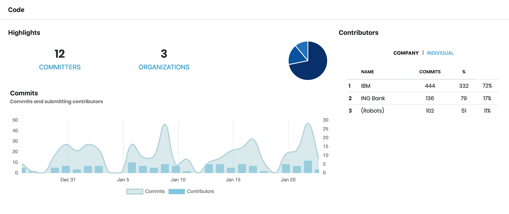

### 组织多元化

问题：什么是贡献的组织多元化？

#### 描述

组织多元化表示一个项目有多少组织参与，以及组织之间不同的参与程度。

#### 目标

* 获取为项目做出贡献的组织列表。
* 查看各组织在特定时间内的贡献百分比。
* 查看组织结构在特定时间内的变化。
* 获取各组织相关的人员列表。

#### 实现

* 从发生贡献的数据源收集数据。
* 确定贡献者的从属关系，对其从属组织作出准确评估。
* 关联贡献相关信息，并将其匹配至适当组织。
* 根据项目需求，您可能需要考虑：如何处理多个电子邮件地址、随时间变化的从属关系，承包商与员工的关系等问题。

##### 提供指标的工具

* [GrimoireLab](https://chaoss.github.io/grimoirelab) 支持组织多元化指标，开箱即用。 [GrimoireLab SortingHat](https://github.com/chaoss/grimoirelab-sortinghat) 管理身份信息。 [GrimoireLab Hatstall](https://github.com/chaoss/grimoirelab-hatstall) 用户界面可以修正人员的组织从属关系，甚至记录从属关系的变化。
  * 查看 [Bitergia Analytics 的 CHAOSS 实例](https://chaoss.biterg.io/app/kibana#/dashboard/Community-Structure-by-Organization)示例可视化效果。
  * 从 [GrimoireLab Sigils 面板集合](https://chaoss.github.io/grimoirelab-sigils/panels/community-structure-by-organization/)下载并导入包含此指标可视化效果示例的现成仪表板。
  * 按照说明向任意 GrimoreLab Kibiter 仪表板添加一个示例可视化效果：
    * 新建一个饼状图
      * 选择 `all_onion` 索引
      * 指标切片大小：`Sum` 聚合，`contributions` 字段，`Contributions` 自定义标签
      * 桶拆分切片：`Terms` 聚合，`author_or_name` 字段，`metric: Contributions` 排序依据，`Descending` 排列，`500` 大小，`Organization` 自定义标签
    * 屏幕截图示例

    

* [LF Analytics](https://lfanalytics.io) 在主视图中为提交、提交的问题和通信渠道（目前支持 Slack 和 groups.io）提供组织多元化指标。

##### 数据收集策略

**定性**

* 组织在项目或生态系统中的足迹
* 组织在项目或生态系统中的影响
* 治理结构中的从属多元化。

**定量**

* 每个组织的commits百分比
* 每个组织的merges/reviews百分比
* 每个组织的任意种类的贡献者百分比
* 每个组织贡献的代码行数百分比
* 每个组织提出的问题(issues)百分比
* [贡献组织](https://github.com/chaoss/metrics/blob/master/activity-metrics/contributing-organizations.md) - 贡献组织的数量是多少？
* [新的贡献组织](https://github.com/chaoss/metrics/blob/master/activity-metrics/new-contributing-organizations.md) - 新的贡献组织的数量是多少？
* 新贡献者组织 - 随着时间推移，对项目作出贡献的新组织。
* 贡献组织的数量 - 在一段时间内参与项目的组织数量。
* 大象系数 - 如果 50% 的社区成员受雇于同一家公司，那就形成了房间里的大象。 公式：员工完成 50% 提交次数的最小公司数量
* [从属多元化](https://github.com/chaoss/metrics/blob/master/activity-metrics/contributor-diversity.md) - 单个公司的贡献者在所有贡献者中的比例。 又称：来自不同公司的维护者。 贡献者从属多元化。
* 在具有代码所有权概念的项目中，从属于每个组织的代码所有者的百分比，按其拥有的代码的重要性/大小/LoC 和共同所有者的数量进行权衡。

#### 参考资料
* 潜在实现和参考资料：
  * [https://bitergia.gitlab.io/panel-collections/open_source_program_office/organizational-diversity.html](https://bitergia.gitlab.io/panel-collections/open_source_program_office/organizational-diversity.html)
  * [Kata Containers 仪表板条目页面](https://katacontainers.biterg.io)（底部）
  * [Augur](https://github.com/chaoss/augur)
